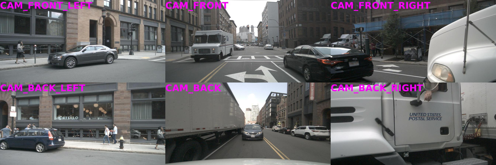
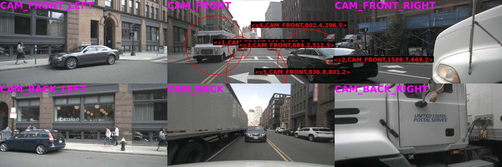

# Visual Question Answering for Autonomous Driving (VQA-AD-CTU)

> **Official implementation** of the Master's thesis *Visual Question Answering for Autonomous Driving*
> — Dmytro Khursenko, Czech Technical University in Prague, Faculty of Electrical Engineering, 2026.
> Supervised by Ing. David Hurych, Ph.D. (Valeo) and doc. Georgios Tolias, Ph.D. (CTU FEE).

[](https://github.com/dmitrykhursen/VQA-AD-CTU) [](https://dmitrykhursen.github.io/VQA-AD-CTU/) [](https://huggingface.co/dkhursen) [](https://huggingface.co/datasets/dkhursen/drivelm-pseudo-labels) [](https://github.com/dmitrykhursen/VQA-AD-CTU)

> 📄 Thesis PDF will be published following successful defense (CTU FEE, 2026; expected by end of June 2026) — the badge above will be updated with a direct link at that point.

---



*Six camera images from a single nuScenes keyframe (CAM_FRONT, CAM_FRONT_LEFT, CAM_FRONT_RIGHT, CAM_BACK, CAM_BACK_LEFT, CAM_BACK_RIGHT) stitched into one panoramic view following InternVL2's multi-image tiling preprocessing. The model answers questions grounded in this image.*

| Category | Question | Ground Truth | Pretrained InternVL2-2B | **Ours — InternVL2-2B-LoRA-25k + 10% DL-PL\*** |
|---|---|---|---|---|
| **perception** | What is the moving status of object `<c1,CAM_FRONT,441.7,485.0>`? A. Turn right. B. Going ahead. C. Stopped. D. Drive backward. | B | The moving status of object `<c1,CAM_FRONT,441.7,485.0>` is C. Stopped. | B |
| **prediction** | Is `<c1,CAM_FRONT,441.7,485.0>` a traffic sign or a road barrier? | No. | To determine if the coordinates `<c1,CAM_FRONT,441.7,485.0>` represent a traffic sign or a road barrier, let's analyze the image closely. 1. **Location and Orientation**: The coordinates are given in the format (x, y, z)… Therefore, the coordinates `<c1,CAM_FRONT,441.7,485.0>` do not represent a traffic sign or road barrier. | No. |
| **planning** | What actions could the ego vehicle take based on `<c1,CAM_FRONT,441.7,485.0>`? Why take this action and what's the probability? | The action is to brake gently to a stop because there is no safety issue, with a high probability. | The ego vehicle, indicated by the camera's position (C1, CAM_FRONT, 441.7, 485.0), is positioned at the intersection of a two-way street. Based on this position, the ego vehicle could take several actions: 1. **Driving straight**… In summary, the ego vehicle has a high probability of continuing straight through the intersection, making a left turn, or continuing straight through the intersection. | The action is to keep going at the same speed. The reason is that there is no safety issue. The probability is high. |
| **behavior** | Predict the behavior of the ego vehicle. A. The ego vehicle is going straight. The ego vehicle is driving slowly. B. The ego vehicle is steering to the left. The ego vehicle is driving very fast. C. The ego vehicle is steering to the right. The ego vehicle is driving slowly. D. The ego vehicle is steering to the left. The ego vehicle is driving with normal speed. | A | The ego vehicle is steering to the right. The ego vehicle is driving slowly. | A |

\* **DL-PL** = DriveLM Pseudo Labels — VQA pairs generated by Qwen3 from nuScenes sensor priors (3D boxes, LiDAR depth, tracking trajectories) and mixed with the aligned training split at a 10% ratio.

---

## Demo

Browse 25 randomly sampled scenes with model comparison side-by-side:

**[Open interactive demo gallery](https://dmitrykhursen.github.io/VQA-AD-CTU/)**

Each scene shows the stitched 6-camera view and all QA pairs with ground-truth vs. model predictions, category labels (perception / prediction / planning / behaviour), and coordinate token highlighting.

> To generate new demos or run inference locally, see [inference/README.md](inference/README.md).

---

## Contents

- [Demo](#demo)
- [Overview](#overview)
- [Prerequisites](#prerequisites)
  - [Environment](#1-environment)
  - [Data](#2-data)
- [Running the Pipeline](#running-the-pipeline)
  - [Stage 0 — Environment activation](#stage-0--environment-activation)
  - [Stage 1 — Custom split](#stage-1--build-custom-data-split)
  - [Stage 2 — Metadata extraction](#stage-2--nuscenes-metadata-extraction)
  - [Stage 3 — Pseudo-label generation](#stage-3--pseudo-label-generation)
  - [Stage 4 — Fine-tuning](#stage-4--fine-tuning)
  - [Stage 5 — Inference](#stage-5--inference)
  - [Stage 6 — Evaluation](#stage-6--evaluation)
  - [Stage 7 — Demo generation](#stage-7--demo-generation)
- [Repository Structure](#repository-structure)
- [Method](#method)
- [Models](#models)
- [Datasets](#datasets)
- [Limitations](#limitations)
- [Citation](#citation)

---

## Overview

Autonomous driving VQA datasets are small and expensive to extend. This work addresses that bottleneck directly: pseudo-labels are generated from structured sensor priors — 2D/3D bounding boxes, LiDAR-derived distances, and object tracking trajectories — using a Large Language Model (Qwen3), and the resulting data is used to fine-tune a Vision-Language Model (VLM) evaluated on the DriveLM benchmark.

Because the official DriveLM-nuScenes splits are **non-i.i.d.** — not due to scene overlap, but due to severe QA-template distributional mismatch: ~65% of training QA templates are absent from the test set, ~10% of test templates never appear in training, and per-template frequency differences reach up to 20 percentage points between splits. A custom scene-level repartition was constructed to produce **25,825 distributionally aligned** training QA pairs. The pipeline was applied to nuScenes scenes recorded in Boston and Singapore and to the Valeo urban driving dataset recorded in Prague, producing a combined corpus of approximately **132,000 pseudo-labelled pairs**.

Key findings:
- **Distributional alignment matters more than data volume**: 25k aligned pairs reached a DriveLM final score of **0.560** vs. **0.493** for 300k non-i.i.d. pairs.
- **Pseudo-label augmentation helps at low mixing ratios**: augmenting with 10% pseudo-labels improved performance further to **0.589**; higher ratios degrade without quality filtering.
- **Visual localization is the dominant bottleneck**: providing ground-truth object localizations raised the DriveLM final score from **0.589 to 0.775**.

---

## Prerequisites

### 1. Environment

Requires **Python 3.11** and CUDA 12.1. Run the setup script from the project root:

```bash
bash scripts/setup_env.sh
source vqa-ad-ctu-env/bin/activate
```

The script creates `./vqa-ad-ctu-env/`, installs PyTorch 2.5.1+cu121 from the PyTorch wheel index, installs all packages from `requirements.txt`, installs the project in editable mode, and attempts to build `flash-attn`. To skip the flash-attn step (e.g. on a login node without a GPU):

```bash
SKIP_FLASH_ATTN=1 bash scripts/setup_env.sh
```

> **HPC note:** Python 3.11 is at `/usr/bin/python3.11` on this cluster. If it is not on your `PATH`, pass it explicitly: `PYTHON=/usr/bin/python3.11 bash scripts/setup_env.sh`.

### 2. Data

**nuScenes images** — download the DriveLM nuScenes image subset (train split, ~12 GB) from one of the mirrors listed in the [DriveLM repo](https://github.com/OpenDriveLab/DriveLM/tree/main/challenge) and unzip under `data/nuScenes/`:

```
data/nuScenes/
└── samples/
    ├── CAM_FRONT/
    ├── CAM_FRONT_LEFT/
    ...
```

**DriveLM annotations** — download `v1_1_train_nus_with_all_metainfo.json` (preferred — includes per-scene `scene_description` metainfo) or the original `v1_1_train_nus.json` (fallback) from the same repo and place them anywhere accessible; the build script picks them up automatically from the cluster default path or via the `DRIVELM_JSON` env var (see Stage 1 below).

---

## Running the Pipeline

The pipeline has seven stages. Each can be run on its own — you do not need to re-run earlier stages if the outputs already exist.

---

### Stage 0 — Environment activation

```bash
source vqa-ad-ctu-env/bin/activate
export HF_HOME=/path/to/hf_cache     # optional: keeps model weights off your home quota
export OPENAI_API_KEY="sk-..."        # required only for Stage 6 (ChatGPT metric)
```

> Java must be on `PATH` for the language-evaluation package used in Stage 6.
> On HPC: `ml Java`. On Ubuntu: `sudo apt-get install default-jre`.

---

### Stage 1 — Build custom data split

Extracts ~30 k QA pairs from the DriveLM training JSON following the challenge question-type distribution, then produces a scene-level stratified 80/10/10 train/val/test split:

```bash
bash scripts/01_build_custom_split.sh
```

Outputs:

```
data/drivelm_custom_split/
├── train.jsonl      # ~25 800 records
├── val.jsonl        # ~3 000 records
├── test.jsonl       # ~3 300 records
└── intermediate/    # intermediate files (can be deleted afterwards)
```

By default the script looks for the preferred annotation file at the cluster path. Override with:

```bash
DRIVELM_JSON=/your/path/v1_1_train_nus_with_all_metainfo.json \
    bash scripts/01_build_custom_split.sh
```

> **Pre-built splits** are already committed under `data/drivelm_custom_split/` — you can skip this stage if you only want to run inference or evaluation.

---

### Stage 2 — NuScenes metadata extraction

Exports per-image 2D + 3D ground-truth annotations from nuScenes (bounding boxes, LiDAR depth, category), then aggregates them into per-scene object tracks with ego-pose information. Both outputs feed Stage 3.

```bash
bash scripts/02_nuscenes_metadata_extraction.sh
```

Override the dataset root or version:

```bash
NUSCENES_ROOT=/your/nuscenes  NUSCENES_VERSION=v1.0-mini \
    bash scripts/02_nuscenes_metadata_extraction.sh
```

Outputs:

```
data/nuscenes-drivelm_metadata/
├── object_annotations/          # per-image JSONs: 2D bbox / 3D bbox
│   └── <sensor>/<log_id>/
│       └── merged_processed.json
└── object_tracks/               # per-scene object tracks with LiDAR depth
    └── <scene_name>/
        └── tracks.json
```

> **Full extraction note:** processing all ~34 k nuScenes keyframes takes several hours.
> A one-scene sample (`n008-2018-05-21-11-06-59-0400`) is pre-copied under
> `data/nuscenes-drivelm_metadata/sample/` so you can run Stage 3 immediately
> without running the full extraction. To use it, set:
> ```bash
> SCENE=n008-2018-05-21-11-06-59-0400 CAMERA=CAM_FRONT \
>     bash scripts/03_run_pipeline_nuscenes.sh
> ```

---

### Stage 3 — Pseudo-label generation

Reads the per-scene annotations and tracks produced in Stage 2, assembles structured scene descriptions, and prompts an LLM (Qwen3 via vLLM) to generate grounded VQA pairs following the DriveLM question-type distribution.

```bash
# single scene / camera (default: sample scene, CAM_FRONT)
bash scripts/03_run_pipeline_nuscenes.sh

# or via SLURM
sbatch scripts/03_run_pipeline_nuscenes.sh
```

Override the scene, camera, or model:

```bash
SCENE=n008-2018-05-21-11-06-59-0400 CAMERA=CAM_FRONT MODEL=Qwen/Qwen3-14B \
    bash scripts/03_run_pipeline_nuscenes.sh
```

The script processes one scene × camera pair. For a full corpus run, loop over all scenes and cameras or submit as a SLURM array with different `SCENE`/`CAMERA` values.

Output:

```
data/drivelm_aug_pseudo_labels/
└── drivelm_pseudo_qas.jsonl    # one JSON line per processed frame
```

Config files used:

```
configs/pipeline/llm_prompt_config.yaml              # system prompts and answer-formatting rules
configs/pipeline/drivelm_qas_ratios_to_gen.json     # question-type target distribution
```

---

### Stage 4 — Fine-tuning

LoRA fine-tuning of InternVL2-2B on the custom i.i.d. split (Stage 1) and optionally augmented with pseudo-labels (Stage 3).

#### Prerequisite — install InternVL

```bash
git clone https://github.com/OpenGVLab/InternVL.git third_party/InternVL
cd third_party/InternVL && git checkout b3f38dc
cd internvl_chat && pip install -e ".[train]"
pip install flash-attn==2.3.6 --no-build-isolation
```

See [third_party/InternVL/README.md](third_party/InternVL/README.md) for details on the two files modified from upstream.

#### Train on DriveLM-25k (base run)

```bash
sbatch scripts/04_finetune.sh
```

The script builds `train_stitched.jsonl` / `val_stitched.jsonl` and the InternVL meta JSONs on-the-fly (if not already present), then launches an 8-GPU `torchrun` job. Checkpoints are saved to `ckpts/finetune/internvl2_2b_lora_25k/`.

Key hyperparameters (see also [configs/finetune/internvl2_2b_lora.yaml](configs/finetune/internvl2_2b_lora.yaml)):

| | |
|---|---|
| LoRA rank / alpha | 16 / 32 |
| Learning rate | 4 × 10⁻⁵ (cosine, warmup 0.03) |
| Effective batch size | 64 (8 GPU × 4 × grad-acc 2) |
| Max sequence length | 8192 |
| Epochs | 10 |
| Precision | bfloat16 |

#### Train with pseudo-label augmentation (DL-PL X%)

```bash
# single split
SPLIT_PCT=10 sbatch scripts/04b_finetune_aug.sh

# all four splits in one go
for pct in 10 30 50 100; do
    sbatch --export=SPLIT_PCT=$pct scripts/04b_finetune_aug.sh
done
```

`SPLIT_PCT` controls what fraction of the pseudo-label corpus (`data/drivelm_aug_pseudo_labels/train_aug${SPLIT_PCT}pct.json`) is mixed in with the 25k DriveLM training set. Results from the paper:

| Model | Final | Acc | ChatGPT | Lang | B1 | B2 | B3 | B4 | RL | CIDEr | Match | Coord |
|---|---:|---:|---:|---:|---:|---:|---:|---:|---:|---:|---:|---:|
| Mini-DA† | 0.606 | 0.898 | 0.668 | 0.416 | 0.596 | 0.564 | 0.533 | 0.503 | 0.651 | 0.470 | 0.381 | 0.000 |
| LoRA-25k | 0.560 | 0.826 | 0.589 | 0.459 | 0.732 | 0.668 | 0.606 | 0.547 | 0.714 | 0.230 | 0.338 | 0.015 |
| **LoRA-25k + DL-PL 10%** | **0.589** | 0.836 | 0.676 | 0.451 | 0.719 | 0.654 | 0.589 | 0.525 | 0.710 | 0.222 | 0.304 | 0.013 |
| LoRA-25k + DL-PL 30% | 0.548 | 0.832 | 0.605 | 0.434 | 0.695 | 0.625 | 0.554 | 0.483 | 0.692 | 0.201 | 0.264 | 0.008 |
| LoRA-25k + DL-PL 50% | 0.532 | 0.832 | 0.584 | 0.433 | 0.691 | 0.622 | 0.551 | 0.481 | 0.699 | 0.171 | 0.230 | 0.007 |
| LoRA-25k + DL-PL 100% | 0.511 | 0.805 | 0.544 | 0.430 | 0.687 | 0.616 | 0.543 | 0.470 | 0.695 | 0.165 | 0.232 | 0.007 |
| LoRA-25k + Valeo | 0.376 | 0.497 | 0.512 | 0.249 | 0.358 | 0.296 | 0.241 | 0.197 | 0.404 | 0.005 | 0.133 | 0.000 |
| LoRA-300k | 0.493 | 0.339 | 0.706 | 0.412 | 0.607 | 0.552 | 0.501 | 0.452 | 0.676 | 0.323 | 0.303 | 0.006 |

† Mini-DA = OpenGVLab/Mini-InternVL2-2B-DA-DriveLM, fine-tuned by OpenGVLab on the original DriveLM training set.

#### Merge LoRA weights

After training, merge the adapter into the base weights to produce a standalone checkpoint:

```bash
# merge all checkpoint-* epochs at once
bash scripts/04c_merge_lora.sh --all_folder ckpts/finetune/internvl2_2b_lora_25k

# or merge a specific epoch
bash scripts/04c_merge_lora.sh \
    --lora_dir  ckpts/finetune/internvl2_2b_lora_25k/checkpoint-500 \
    --merged_dir ckpts/finetune/internvl2_2b_lora_25k_merged
```

Merged checkpoints can be used directly in Stage 5 (inference) by setting `MODEL=` to the merged directory path.

> **Pre-trained checkpoints** are available on HuggingFace under [huggingface.co/dkhursen](https://huggingface.co/dkhursen) — you can skip this stage and load a checkpoint directly in Stage 5.

---

### Stage 5 — Inference

Single model (SLURM, 8-GPU node):

```bash
sbatch scripts/05_inference.sh
```

All splits at once (val + local test + orig DriveLM test, SLURM job array):

```bash
sbatch scripts/05_inference_all_splits.sh
```

Edit `MODEL=` inside the script to switch between checkpoints. Outputs land in `inference/outputs/<MODEL>/local_test.json`.

Pre-computed inference outputs for all paper models are already committed under
`inference/outputs/` — you can skip this stage and go directly to Stage 6 (evaluation) or Stage 7 (demo).

---

### Stage 6 — Evaluation

Runs the full DriveLM metric suite (Accuracy, ChatGPT, Language, Match, Coord) against a prediction file produced by Stage 5:

```bash
bash scripts/06_evaluate.sh inference/outputs/<MODEL>/local_test.json
```

The reference split defaults to `data/drivelm_custom_split/test.jsonl`. Override with a second argument:

```bash
bash scripts/06_evaluate.sh inference/outputs/<MODEL>/local_test.json \
    data/drivelm_custom_split/test.jsonl
```

Results are printed to stdout and a JSON breakdown is saved next to the prediction file.

To print the pre-computed results table for all models at once:

```bash
python evaluation/print_results.py
```

---

### Stage 7 — Demo generation

Visualises model predictions side-by-side with ground truth for individual scenes or the full gallery.

Quick single-scene demo (renders all QA pairs for one frame):

```bash
python inference/demo.py \
    --prediction inference/outputs/<MODEL>/local_test.json \
    --scene-frame <scene_token>_<frame_token>
```

Generate a standalone HTML comparison page for one scene:

```bash
python inference/scene_demo.py \
    --scene-frame <scene_token>_<frame_token> \
    --output docs/my_scene.html
```

Regenerate the full 25-scene gallery (used for GitHub Pages at `dmitrykhursen.github.io/VQA-AD-CTU`):

```bash
python inference/make_demo_index.py
```

See [inference/README.md](inference/README.md) for the full CLI reference and how to pick scene/frame tokens from the test split.

---

## Repository Structure

```
.
├── src/
│   ├── datasets/                   # Stage 1: DriveLM extraction and split utilities
│   ├── pipeline/
│   │   ├── nuscenes_labeled/       # Stage 2: annotation export + track generation
│   │   └── llm_orchestration/      # Stage 3: LLM-based QA generation
│   ├── training/
│   │   ├── make_stitched_jsonl.py  # Stage 4: convert 6-cam JSONL → stitched JSONL
│   │   ├── build_internvl_meta.py  # Stage 4: build InternVL training meta JSON
│   │   └── merge_lora.py           # Stage 4: merge LoRA adapters into base model
│   ├── models/                     # Stage 5: inference backends (InternVL, LLaVA, LLaMA-Adapter)
│   ├── inference/                  # Stage 5: batched distributed inference
│   ├── evaluation/                 # Stage 6: DriveLM metric suite
│   └── utils/                     # Shared helpers
├── scripts/
│   ├── setup_env.sh                # Stage 0: create venv, install dependencies
│   ├── 01_build_custom_split.sh    # Stage 1: build 80/10/10 scene-level split
│   ├── 02_nuscenes_metadata_extraction.sh  # Stage 2: export nuScenes annotations + tracks
│   ├── 03_run_pipeline_nuscenes.sh # Stage 3: LLM pseudo-label generation (one scene/camera)
│   ├── 04_finetune.sh              # Stage 4: LoRA fine-tuning on DriveLM-25k
│   ├── 04b_finetune_aug.sh         # Stage 4: fine-tuning with DL-PL augmentation
│   ├── 04c_merge_lora.sh           # Stage 4: merge LoRA adapters into base model
│   ├── 05_inference.sh             # Stage 5: batched inference (single split)
│   ├── 05_inference_all_splits.sh  # Stage 5: SLURM job array over all three splits
│   └── 06_evaluate.sh              # Stage 6: DriveLM evaluation suite
├── configs/
│   ├── pipeline/
│   │   ├── llm_prompt_config.yaml             # Prompts and answer-formatting rules (Stage 3)
│   │   └── drivelm_qas_ratios_to_gen.json     # Question-type target distribution (Stage 3)
│   └── finetune/
│       └── internvl2_2b_lora.yaml             # LoRA hyperparameter reference (Stage 4)
├── third_party/
│   ├── InternVL/                   # Clone OpenGVLab/InternVL here for Stage 4 (code not committed)
│   │   └── README.md               # Clone instructions and list of upstream modifications
│   ├── DriveLM/                    # Clone OpenDriveLab/DriveLM here for LLaMA-Adapter (code not committed)
│   │   └── ORIGIN.md               # Attribution; adapted code lives in src/datasets/ and src/evaluation/
│   └── LLaMA-Adapter/              # Reference — OpenGVLab/LLaMA-Adapter (code not committed)
│       └── ORIGIN.md               # Attribution; backend lives in src/models/llama_adapterv2.py
├── data/
│   ├── drivelm/                    # Original DriveLM annotations (download separately)
│   ├── drivelm_custom_split/       # Stage 1 outputs — train/val/test JSONL splits
│   ├── drivelm_aug_pseudo_labels/  # Stage 3 outputs + augmented mixing splits
│   └── nuscenes-drivelm_metadata/
│       ├── object_annotations/     # Stage 2: per-image 2D+3D annotation JSONs
│       ├── object_tracks/          # Stage 2: per-scene track JSONs
│       └── sample/                 # Pre-extracted single scene for quick Stage 3 testing
├── ckpts/                          # Model checkpoints (weights gitignored — download from HuggingFace)
│   └── README.md                   # Checkpoint index and HuggingFace download links
├── inference/
│   ├── demo.py                     # Stage 7: quick single-scene HTML demo
│   ├── scene_demo.py               # Stage 7: standalone HTML comparison page per scene
│   ├── make_demo_index.py          # Stage 7: regenerate the full 25-scene gallery
│   ├── outputs/                    # Pre-computed prediction JSONs for all paper models
│   └── README.md
├── evaluation/
│   ├── print_results.py            # Print unified results table for all models
│   ├── results/                    # Per-model evaluation output JSONs
│   └── README.md
├── docs/                           # GitHub Pages — interactive demo gallery (25 scenes)
├── assets/                         # Static images for this README
└── notebooks/                      # Exploratory analysis and visualisation notebooks
```

---

## Method

### Pseudo-Label Generation Pipeline

Structured sensor priors from nuScenes (Boston + Singapore) and Valeo (Prague) are extracted and passed to **Qwen3** — with chain-of-thought reasoning enabled — to generate natural-language VQA pairs grounded in the physical annotations.

| Input | Source |
|---|---|
| 2D / 3D bounding boxes | nuScenes GT / YOLO (unlabelled) |
| Per-object metric depth | LiDAR point cloud projection |
| Tracking trajectories | Multi-frame object IDs |
| Ego-vehicle state | nuScenes CAN bus |

### Fine-Tuning

Base model: **InternVL2-2B** with LoRA adaptation.
Evaluated on a custom i.i.d. re-split of DriveLM-nuScenes.

| Model | Visual Annotation | Final | Acc | ChatGPT | Lang | Match | Coord\* |
|---|---|---:|---:|---:|---:|---:|---:|
| ***Pretrained baselines*** | | | | | | | |
| InternVL2-2B | — | 0.293 | 0.000 | 0.573 | 0.080 | 0.241 | 0.004 |
| LLaVA-1.6 | — | 0.280 | 0.003 | 0.552 | 0.059 | 0.224 | 0.000 |
| LLaMA-Adapter-v2 | — | 0.267 | 0.000 | 0.533 | 0.093 | 0.176 | 0.000 |
| ***Fine-tuned (InternVL2-2B + LoRA)*** | | | | | | | |
| Mini-DA | — | 0.606 | 0.898 | 0.668 | 0.416 | 0.381 | 0.000 |
| LoRA-25k | — | 0.560 | 0.826 | 0.589 | 0.459 | 0.338 | 0.015 |
| **LoRA-25k + DL-PL 10%** | — | **0.589** | 0.836 | 0.676 | 0.451 | 0.304 | 0.013 |
| LoRA-25k + DL-PL 30% | — | 0.548 | 0.832 | 0.605 | 0.434 | 0.264 | 0.008 |
| LoRA-25k + DL-PL 50% | — | 0.532 | 0.832 | 0.584 | 0.433 | 0.230 | 0.007 |
| LoRA-25k + DL-PL 100% | — | 0.511 | 0.805 | 0.544 | 0.430 | 0.232 | 0.007 |
| LoRA-25k + Valeo | — | 0.376 | 0.497 | 0.512 | 0.249 | 0.133 | 0.000 |
| LoRA-300k | — | 0.493 | 0.339 | 0.706 | 0.412 | 0.303 | 0.006 |
| ***Oracle — offline visual annotation (Red Circle, best variant)*** | | | | | | | |
| LoRA-25k | **Red Circle + CTags + Bkgd** | **0.775** | 0.853 | 0.725 | 0.779 | **0.793** | **0.758** |
| LoRA-25k | Red Circle + CTags | 0.624 | 0.727 | 0.728 | 0.695 | 0.430 | 0.141 |
| LoRA-25k | Red Circle | 0.646 | 0.793 | 0.729 | 0.761 | 0.443 | 0.158 |

\* **Coord** is not included in the DriveLM Final Score. **Final Score = 0.4 × (GPT/100) + 0.2 × Language + 0.2 × (Match/100) + 0.2 × Accuracy**. **Match = (F1_coord × 100 + GPT_match) / 2** — blends spatial coordinate F1 with a GPT-3.5-turbo judge on prediction answers; near-zero Coord across all online models confirms that visual object grounding is the dominant bottleneck for current VLMs on this benchmark.

> Full results including all annotation variants and per-metric breakdown (BLEU-1–4, ROUGE-L, CIDEr): [evaluation/README.md](evaluation/README.md) or run `python evaluation/print_results.py`.

> **Note on evaluation scope.** All scores in this table are measured on the **custom i.i.d. local test split** (3,340 QA pairs) using the local DriveLM evaluation script. The official DriveLM evaluation server was not used as the primary reporting source: it returns only aggregate scores without per-metric breakdown, the infrastructure was intermittently unreliable (parsing errors in model output could not be diagnosed or corrected directly — only via GitHub issues), and the ChatGPT/Match metrics depend on OpenAI API calls that fail mid-run when the API quota for the billing period is exhausted.

### Oracle — Offline Visual Grounding

To quantify how much of the remaining error comes from the model failing to localise objects visually, we ran an oracle experiment: ground-truth 3D bounding boxes are projected onto the images at test time and rendered as **red circles** around each object, with **class-name text labels** (CTags) overlaid and the **background dimmed** to make annotated objects pop. The model weights are unchanged — only the input images differ.

| Metric | Raw image (LoRA-25k + 10% DL-PL) | + Red Circle + CTags + Background |
|---|:---:|:---:|
| **Final** | 0.589 | **0.775** |
| Accuracy | 0.836 | 0.853 |
| ChatGPT | 0.676 | 0.725 |
| Language | 0.451 | **0.779** |
| **Match** | 0.304 | **0.793** |
| **Coord** | 0.013 | **0.758** |

The jump from **0.589 → 0.775** (Final) and **0.013 → 0.758** (Coord) with no model change shows that visual object grounding — not language understanding — is the dominant bottleneck for VLMs on this benchmark.

| Without annotation | With Red Circle + CTags + Background |
|:---:|:---:|
|  |  |

---

## Models

### Pretrained baselines (sources)

| Model | Source |
|---|---|
| InternVL2-2B | [huggingface.co/OpenGVLab/InternVL2-2B](https://huggingface.co/OpenGVLab/InternVL2-2B) |
| LLaVA-1.6 (Mistral-7B) | [huggingface.co/llava-hf/llava-v1.6-mistral-7b-hf](https://huggingface.co/llava-hf/llava-v1.6-mistral-7b-hf) |
| LLaMA-Adapter-v2 | [github.com/OpenGVLab/LLaMA-Adapter](https://github.com/OpenGVLab/LLaMA-Adapter) |

### Fine-tuned reference (external)

| Model | Source |
|---|---|
| Mini-InternVL2-2B-DA-DriveLM (Mini-DA†) — fine-tuned by OpenGVLab on the original DriveLM training set | [huggingface.co/OpenGVLab/Mini-InternVL2-2B-DA-DriveLM](https://huggingface.co/OpenGVLab/Mini-InternVL2-2B-DA-DriveLM) |

### Fine-tuned checkpoints (ours)

Hosted on HuggingFace: **[huggingface.co/dkhursen](https://huggingface.co/dkhursen)**

| Model | HuggingFace |
|---|---|
| InternVL2-2B-LoRA-25k (our custom i.i.d. split) | [dkhursen/InternVL2-2b-LoRA-25k-drivelm](https://huggingface.co/dkhursen/InternVL2-2b-LoRA-25k-drivelm) |
| **InternVL2-2B-LoRA-25k + 10% DL-PL (best)** | [dkhursen/InternVL2-2b-LoRA-25k_plus_DL-PL-10pct](https://huggingface.co/dkhursen/InternVL2-2b-LoRA-25k_plus_DL-PL-10pct) |
| InternVL2-2B-LoRA-300k (official split) | [dkhursen/InternVL2-2b-LoRA-300k-drivelm](https://huggingface.co/dkhursen/InternVL2-2b-LoRA-300k-drivelm) |
| InternVL2-2B-LoRA-25k + Oracle visual annotation | [dkhursen/InternVL2-2b-LoRA-25k-drivelm-offline-redcircle-ctag-bkgd](https://huggingface.co/dkhursen/InternVL2-2b-LoRA-25k-drivelm-offline-redcircle-ctag-bkgd) |

---

## Datasets

- **DriveLM-nuScenes**: [github.com/OpenDriveLab/DriveLM](https://github.com/OpenDriveLab/DriveLM) — detailed dataset statistics, QA-template distribution analysis, and the non-i.i.d. split problem are described in the thesis (see link above)
- **nuScenes**: [nuscenes.org](https://www.nuscenes.org/)
- **DriveLM Pseudo Labels** (ours): [huggingface.co/datasets/dkhursen/drivelm-pseudo-labels](https://huggingface.co/datasets/dkhursen/drivelm-pseudo-labels)
- **Valeo dataset**: proprietary — not publicly available yet.


---

## Limitations

- **No quality filtering on pseudo-labels.** Every generated QA pair is used at face value regardless of internal consistency or factual grounding. Filtering strategies such as self-consistency checks or rule-based checklists are known to be effective; without them the usable augmentation ratio is artificially capped — as the degrading performance at 30–100% mixing confirms.
- **Camera distribution bias at high augmentation ratios.** The pseudo-label generation templates have an ego-centric forward bias, disproportionately referencing objects in the forward field of view. This contributes to the performance drop at higher mixing ratios; a camera-reweighted or upsampled variant was not tested.
- **Pretrained baselines only — no fine-tuning on LLaVA-1.6 or LLaMA-Adapter-v2.** These models appear only as zero-shot baselines. InternVL2-2B was selected as the fine-tuning architecture based on its stronger pretrained performance on DriveLM-nuScenes and its native multi-image input support, which aligns naturally with the 6-camera setup.

---

## Development Notes

Parts of this codebase were developed with assistance from Claude Code and GitHub Copilot. Code was reviewed and tested by the author.

---

## Citation

If you find this work useful, please cite:

```bibtex
@mastersthesis{khursenko2026vqa,
  author  = {Khursenko, Dmytro},
  title   = {Visual Question Answering for Autonomous Driving},
  school  = {Czech Technical University in Prague, Faculty of Electrical Engineering},
  year    = {2026},
  supervisor = {Hurych, David and Tolias, Georgios}
}
```


---
